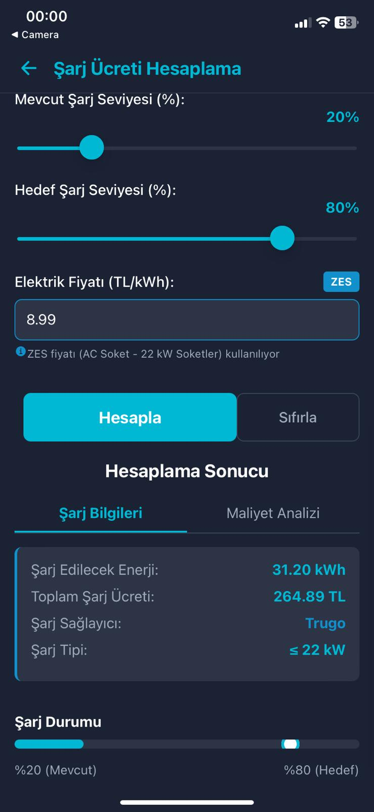

# EVPriceMobile - Elektrikli Araç Yol Arkadaşı

EVPriceMobile, elektrikli araç sahipleri için tasarlanmış kapsamlı bir mobil uygulamadır. Uygulama, elektrikli araç kullanıcılarının yolculuklarını planlamalarına, şarj istasyonlarını bulmalarına ve maliyetleri hesaplamalarına yardımcı olur.

## 🌟 Özellikler

### 🗺️ Akıllı Rota Planlama
- Gerçek zamanlı rota optimizasyonu
- Şarj istasyonları entegrasyonu
- Dinlenme noktaları önerileri
- Şehirler arası geçiş bilgileri
- Rota üzerindeki şehirlerin otomatik tespiti

### 🔌 Şarj İstasyonu Yönetimi
- Yakındaki şarj istasyonlarını görüntüleme
- İstasyon doluluk oranları
- Şarj maliyeti hesaplama
- İstasyon detayları ve yönlendirme
- Rota üzerindeki şarj noktalarını planlama

### 💰 Maliyet Hesaplama
- Detaylı şarj maliyeti analizi
- Farklı şarj sağlayıcıları karşılaştırma
- Rota bazlı toplam maliyet hesaplama
- Dinlenme noktaları maliyetleri

### 👤 Kullanıcı Yönetimi
- Kişiselleştirilmiş profil
- Araç bilgileri yönetimi
- Geçmiş rotalar
- Geçmişte yapılan şarj bilgileri

## 📱 Ekran Görüntüleri

<table>
  <tr>
    <td align="center">
      <strong>Anasayfa</strong><br/>
      
    </td>
    <td align="center">
      <strong>Kullanıcı Giriş Sayfası</strong><br/>
      
    </td>
    <td align="center">
      <strong>API Test Sayfası</strong><br/>
      
    </td>
  </tr>
  <tr>
    <td align="center">
      <strong>Şarj Maliyet Sayfası - 1</strong><br/>
      
    </td>
    <td align="center">
      <strong>Şarj Maliyet Sayfası - 2</strong><br/>
      
    </td>
    <td align="center">
      <strong>Şarj Maliyet Sayfası - 3</strong><br/>
      
    </td>
  </tr>
  <tr>
    <td align="center">
      <strong>Harita Sayfası - 1</strong><br/>
      
    </td>
    <td align="center">
      <strong>Harita Sayfası - 2</strong><br/>
      
    </td>
    <td align="center">
      <strong>Harita Sayfası - 3</strong><br/>
      
    </td>
  </tr>
  <tr>
    <td align="center">
      <strong>Harita Sayfası - 4</strong><br/>
      
    </td>
    <td align="center">
      <strong>Harita Sayfası - 5</strong><br/>
      
    </td>
    <td align="center">
      <strong>Harita Sayfası - 6</strong><br/>
      
    </td>
  </tr>
  <tr>
      <td align="center">
      <strong>Harita Sayfası - 7</strong><br/>
      
    </td>
      <td align="center">
      <strong>Rota Detayları Sayfası</strong><br/>
      
    </td>
      <td align="center">
      <strong>Rota Bilgisi Sayfası</strong><br/>
      
    </td>
  </tr>
  <tr>
      <td align="center">
      <strong>Kullanıcı Sayfası - 1</strong><br/>
      
    </td>
     <td align="center">
      <strong>Kullanıcı Sayfası - 2</strong><br/>
      
    </td>
    <td align="center">
      <strong>Kullanıcı Sayfası - 3</strong><br/>
      
    </td>
  </tr>
</table>

## 🛠️ Teknik Özellikler

- React Native ile geliştirilmiş cross-platform mobil uygulama
- Google Maps API entegrasyonu
- Gerçek zamanlı konum takibi
- RESTful API entegrasyonu
- Offline çalışma desteği
- Animasyonlu kullanıcı arayüzü
- Responsive tasarım

## 🔧 Kurulum

1. Projeyi klonlayın:
```bash
git clone https://github.com/yourusername/EVPriceMobile.git
```

2. Bağımlılıkları yükleyin:
```bash
cd EVPriceMobile
npm install
```

3. Gerekli API anahtarlarını ayarlayın:
- Google Maps API anahtarı

4. Uygulamayı başlatın:
```bash
npm start
```


## 🤝 Katkıda Bulunma

1. Bu depoyu fork edin
2. Yeni bir özellik dalı oluşturun (`git checkout -b feature/amazing-feature`)
3. Değişikliklerinizi commit edin (`git commit -m 'Add some amazing feature'`)
4. Dalınıza push edin (`git push origin feature/amazing-feature`)
5. Bir Pull Request oluşturun
