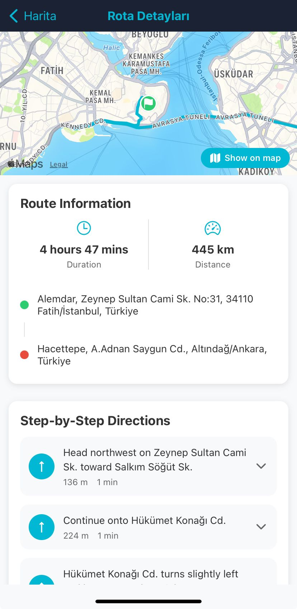
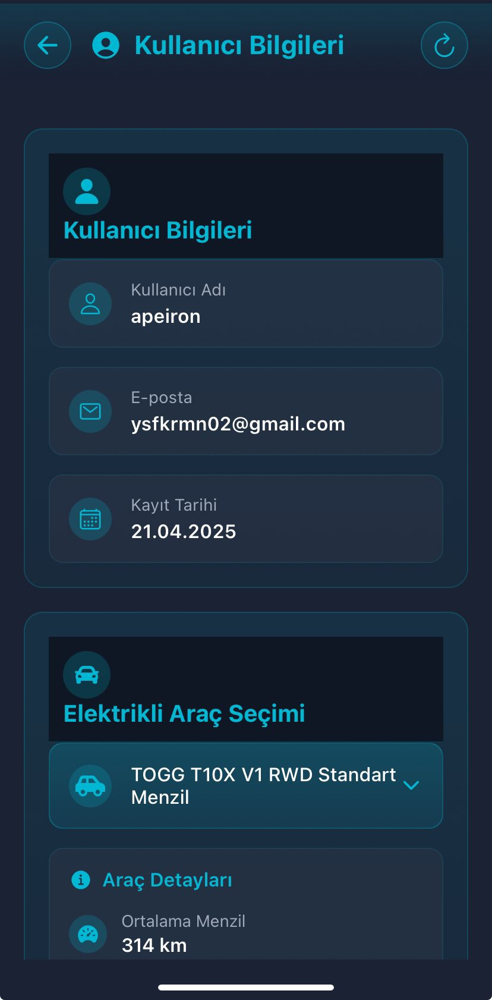
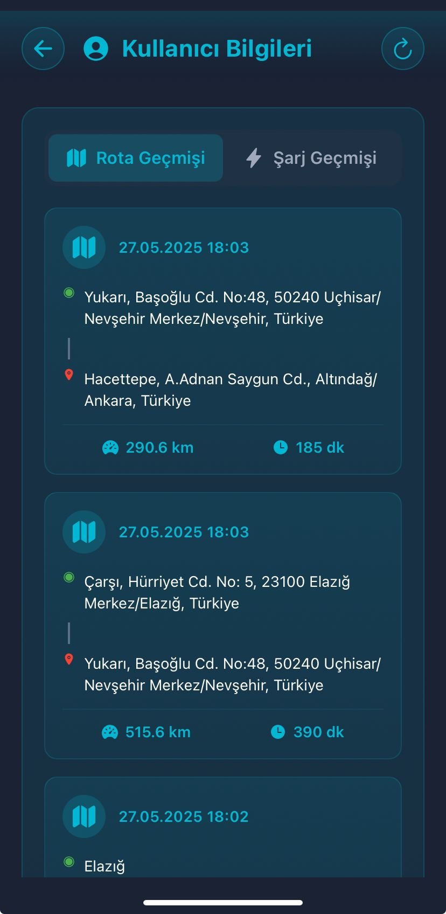

# EVPriceMobile

<table>
  <tr>
    <td align="center">
      <strong>Anasayfa</strong> 
      
    </td>
    <td align="center">
      <strong>Kullanıcı Giriş Sayfası</strong> 
      
    </td>
    <td align="center">
      <strong>API Test Sayfası</strong> 
      
    </td>
  </tr>
  <tr>
    <td align="center">
      <strong>Şarj Maliyet Sayfası - 1</strong> 
      
    </td>
    <td align="center">
      <strong>Şarj Maliyet Sayfası - 2</strong> 
      
    </td>
    <td align="center">
      <strong>Şarj Maliyet Sayfası - 3</strong> 
      
    </td>
  </tr>
  <tr>
    <td align="center">
      <strong>Harita Sayfası - 1</strong> 
      
    </td>
    <td align="center">
      <strong>Harita Sayfası - 2</strong> 
      
    </td>
    <td align="center">
      <strong>Harita Sayfası - 3</strong> 
      
    </td>
  </tr>
  <tr>
    <td align="center">
      <strong>Harita Sayfası - 4</strong> 
      
    </td>
    <td align="center">
      <strong>Harita Sayfası - 5</strong> 
      
    </td>
    <td align="center">
      <strong>Harita Sayfası - 6</strong> 
      
    </td>
  </tr>
  <tr>
      <td align="center">
      <strong>Harita Sayfası - 7</strong> 
      
    </td>
      <td align="center">
      <strong>Rota Detayları Sayfası</strong> 
      
    </td>
      <td align="center">
      <strong>Rota Bilgisi Sayfası</strong> 
      
    </td>
  </tr>
  <tr>
      <td align="center">
      <strong>Kullanıcı Sayfası - 1</strong> 
      
    </td>
     <td align="center">
      <strong>Kullanıcı Sayfası - 2</strong> 
      
    </td>
    <td align="center">
      <strong>Kullanıcı Sayfası - 3</strong> 
      
    </td>
  <tr>
  </tr>
</table>
